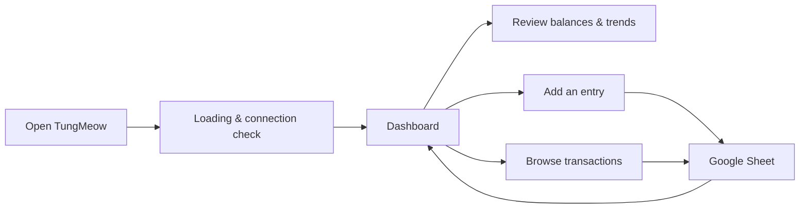
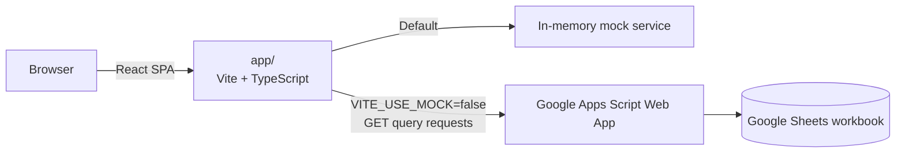

<div align="center">
  

  <h1>TungMeow · ตังค์เหมียว</h1>

  <h3>Your Google Sheet, made delightful for everyday money.</h3>

  <p>A warm, cat-themed personal finance tracker that turns a Google Sheet into a polished, responsive web app.</p>

  <p>
    <a href="https://react.dev/"></a>
    <a href="https://www.typescriptlang.org/"></a>
    <a href="https://vite.dev/"></a>
    <a href="https://tailwindcss.com/"></a>
    <a href="https://www.google.com/script/start/"></a>
  </p>

  <p>
    <a href="https://tungmeow.vercel.app">Live app</a> ·
    <a href="#-quick-start">Quick start</a> ·
    <a href="#-architecture">Architecture</a> ·
    <a href="gas/DEPLOYMENT.md">Deploy backend</a>
  </p>
</div>

---

## ✨ Why TungMeow?

TungMeow (ตังค์เหมียว, literally “money cat”) is designed for a person or household who wants the simplicity and ownership of Google Sheets without having to manage day-to-day money in a spreadsheet UI. Your sheet remains the source of truth; TungMeow makes it pleasant to read, search, and update.

| What you get | Details |
| --- | --- |
| 🐾 **A friendly daily dashboard** | Balances, income, expenses, six-period trends, top categories, recent activity, and a gentle logging streak. |
| 🧾 **A practical ledger** | Per-account tabs, search, category/type filters, pagination, and responsive transaction cards. |
| ➕ **Fast entry logging** | Add income or an expense with category, date, amount, description, and an optional note. |
| 📊 **Simple category insights** | Drill into spending categories without giving up the raw data in Sheets. |
| 📱 **One responsive experience** | Desktop sidebar and mobile bottom navigation, built from the same React app. |
| 🔄 **Data you own** | Every account is a worksheet tab inside one Google spreadsheet—no separate app database. |

## 🖼️ Product flow



## 🏗️ Architecture



The frontend depends on a `DataService` interface, so development can use realistic seeded mock data while production calls the Apps Script backend. The backend reads and writes the spreadsheet directly; it does not introduce a second database.

> [!NOTE]
> Every production action—including `addTransaction`, `deleteTransaction`, and `syncNow`—uses a URL-encoded `GET` request. This is intentional: it avoids browser CORS preflight behavior that Google Apps Script web apps do not handle for this project.

## 🚀 Quick start

### Prerequisites

- [Node.js](https://nodejs.org/) 20 or newer (LTS recommended)
- npm (bundled with Node.js)
- A Google account only when connecting the real Google Sheets backend

### Run with sample data

The mock data service is the default, so no environment variables are needed for a local UI preview.

```bash
git clone https://github.com/EarthStrixDEV/TungMeow.git
cd TungMeow/app
npm install
npm run dev
```

Open the local URL printed by Vite (normally `http://localhost:5173`).

### Useful commands

Run these inside `app/`:

| Command | Purpose |
| --- | --- |
| `npm run dev` | Start the Vite development server with hot reload. |
| `npm run build` | Type-check the application and create a production build in `app/dist/`. |
| `npm run lint` | Run Oxlint. |
| `npm run preview` | Serve the most recent production build locally. |

> [!TIP]
> Use `npm run build` for a complete type check. The root TypeScript configuration is references-only, so a bare `tsc --noEmit` is not an equivalent check.

## 🔌 Connect a real Google Sheet

The app uses the mock data service unless `VITE_USE_MOCK` is explicitly set to `false`.

1. Follow the complete Thai step-by-step guide in [gas/DEPLOYMENT.md](gas/DEPLOYMENT.md) to create the Apps Script project, set its properties, run `setupSheet()`, and deploy it as a Web App.
2. Create `app/.env.local` (this file is gitignored).
3. Add your deployment URL and the token saved in Apps Script Script Properties:

```dotenv
VITE_USE_MOCK=false
VITE_APPS_SCRIPT_URL=https://script.google.com/macros/s/YOUR_DEPLOYMENT_ID/exec
VITE_APPS_SCRIPT_TOKEN=your-long-random-token
```

4. Restart `npm run dev`.

### Sheet structure created by `setupSheet()`

```text
TungMeow Ledger
├── Cash
├── Bank_KBank
├── Credit_Card
├── Savings
└── _TungMeow_Meta     (hidden account metadata)
```

Each account tab uses the following columns:

| Column | Field | Notes |
| --- | --- | --- |
| A | `Date` | ISO date, `YYYY-MM-DD` |
| B | `Description` | Transaction title |
| C | `Category` | Fixed TungMeow category |
| D | `Type` | `income` or `expense` |
| E | `Amount` | Positive number; the app derives the sign from `Type` |
| F | `Note` | Optional supporting note |

Transaction IDs are derived as `{sheetTabName}:{rowNumber}`. Because deleting a row can shift later row numbers, the app refreshes data rather than trying to patch stale transaction IDs locally.

## 🔐 Environment and security notes

| Variable | Required | Description |
| --- | --- | --- |
| `VITE_USE_MOCK` | No | Set to `false` to call Google Apps Script. Any other value, or omission, uses mock data. |
| `VITE_APPS_SCRIPT_URL` | When real backend is enabled | The deployed Apps Script Web App URL ending in `/exec`. |
| `VITE_APPS_SCRIPT_TOKEN` | When real backend is enabled | Must match the `API_TOKEN` Script Property in Apps Script. |

> [!WARNING]
> Vite variables prefixed with `VITE_` are exposed to the browser at build time. The token is a lightweight access gate for this single-user project—not a replacement for user authentication, secret storage, or rate limiting. Do not reuse it for another service or store sensitive credentials in the repository.

## 🧩 API actions

The Apps Script router returns a consistent envelope:

```ts
// Success
{ ok: true, data: /* action payload */ }

// Failure
{ ok: false, error: { code: string, message: string } }
```

| Action | What it does |
| --- | --- |
| `listAccounts` | Lists account metadata. |
| `listAccountSummaries` | Lists accounts with balances and row counts. |
| `listTransactions` | Gets a paginated, filtered ledger for an account. |
| `listRecentTransactions` | Gets recent transactions across accounts. |
| `addTransaction` | Appends a new ledger row. |
| `deleteTransaction` | Deletes a sheet row for the supplied transaction ID. |
| `getDashboardStats` | Gets balance, income/expense, chart, and top-category data for a period. |
| `getConnectionInfo` | Verifies connection details and health. |
| `syncNow` | Clears the server cache and returns fresh connection data. |

## 🗂️ Repository map

```text
.
├── app/                         # Production React single-page app
│   ├── public/favicon.svg        # Browser-tab cat logo
│   └── src/
│       ├── components/           # Brand, layout, and reusable UI primitives
│       ├── data/                 # DataService contract, mock, and Apps Script clients
│       ├── features/             # Dashboard, transaction, settings, and add-entry modules
│       ├── pages/                # Route-level screens
│       └── lib/                  # Formatting, periods, responsive, and insight helpers
├── gas/                          # Google Apps Script backend
│   ├── Code.gs                   # Bootstrap and HTTP entry points
│   ├── Router.gs                 # Token validation and action dispatch
│   ├── SheetService.gs           # Sheet reads, writes, and aggregation logic
│   └── DEPLOYMENT.md             # Manual backend deployment guide (Thai)
├── tungmeow-html/                # Earlier static HTML prototype
├── TungMeow-Spec.md              # MVP product and design contract
├── TungMeow-design-context.md    # Original design context and wireframes
└── PROJECT-OVERVIEW.md           # Engineering overview and project decisions
```

## 🎨 Design system

TungMeow balances playful character with clear financial information:

- **Brand:** the finance cat carries a blue collar and coin with an upward chart—friendly but purposeful.
- **Colors:** warm cream surfaces, charcoal ink, trustworthy blue for income, and warm orange for expense.
- **Typography:** `Baloo 2` for warm display moments and `Nunito` for readable interface copy.
- **Responsive rule:** desktop uses a fixed sidebar at the `861px` breakpoint; smaller screens use the bottom navigation.
- **Accessibility-minded UI:** focused hierarchy, clear money-color associations, contextual states, and touch-friendly controls.

## 🌐 Deployment

### Frontend · Vercel

The frontend is configured as an SPA through [app/vercel.json](app/vercel.json), which rewrites routes to `index.html`. This lets direct visits such as `/transactions` resolve correctly.

Connect the repository to Vercel and configure the same `VITE_*` variables in the Vercel project when using the real backend. A push to `main` triggers Vercel’s Git-based deployment.

### Backend · Google Apps Script

Backend changes are deployed manually. After editing a `.gs` file in the Apps Script editor, open **Deploy → Manage deployments**, create a **New version**, and deploy it. The Web App URL remains the same, but it will serve the new version.

For the complete setup, authorization, smoke-test, and troubleshooting steps, follow [gas/DEPLOYMENT.md](gas/DEPLOYMENT.md).

## ✅ Quality checks

Before opening a pull request or deploying frontend changes:

```bash
cd app
npm run lint
npm run build
```

For exploratory UI checks, `qa-screens/` contains local-only Playwright smoke/screenshot scripts. It is intentionally not wired into CI and generated screenshots are gitignored.

## 🤝 Contributing

1. Keep the Google Sheet as the only financial-data source of truth.
2. Preserve the `DataService` contract when changing data behavior; update both the mock and Apps Script implementations when required.
3. Do not commit `.env.local`, tokens, or real ledger data.
4. Run lint and a production build before submitting changes.
5. When changing the backend, update the deployed Apps Script version separately from the frontend deployment.

---

<div align="center">
  <p>Built with care for calmer money days. 🐾</p>
</div>
